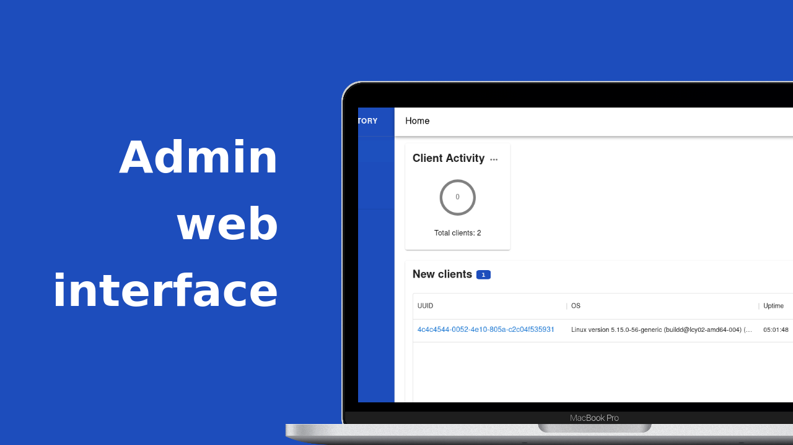

<!-- PROJECT LOGO -->
 

  <a href="https://github.com/Mozzo1000/client-inventory">
    💻
  </a>

<h3 align="center">Client Inventory</h3>

  

    A management tool for keeping an inventory of all your managed computers.
     
    <a href="https://github.com/Mozzo1000/inventory/wiki"><strong>Explore the docs »</strong></a>
     
     
    <a href="https://github.com/github_username/repo_name"><s>View Demo</s></a>
    ·
    <a href="https://github.com/Mozzo1000/client-inventory/issues">Report Bug</a>
    ·
    <a href="https://github.com/Mozzo1000/client-inventory/issues">Request Feature</a>
  

## About the project

`Client Inventory` is an self-hosted, agent-based inventory management tool aimed for use at businesses that wants to keep track of their IT assets. 

It has an API for integrating custom agents and admin interfaces. But also comes with a fully featured web interface and an agent for Linux.

It only collects information and can **not** control the computer in which the agent is installed on.

### Built with
* 
* 

## Features
* Platform agnostic design
* Automatic agent-based information collector
* Quick overview of clients
* Privacy and end user focused

## Privacy by design
This application has been made with privacy in mind. It aims to not collect any directly user identifable information (although indirect user information may be collected, see definition below).

With using this application you shall in a direct manner inform the user that is subject to the collection of information about what is being collected, why and how you are using the collected information.

### Direct and indirect user identificable information
With direct user identifiable information we mean information that can without any other system, tool or likewise identify the person who owns/uses the computer

Indirect information is information that may be able to be linked to a specific user but requires the use of separat system, tool or likewise in order to identify the person.

## Repository structure
* `server` 
  * contains the code for the API server
* `web`
  * contains the code for the administrative web interface

## Contributing
All contributions are welcome!

## License
`Client Inventory` is licensed under the Apache License, Version 2.0. See [LICENSE](LICENSE) for the full license text.